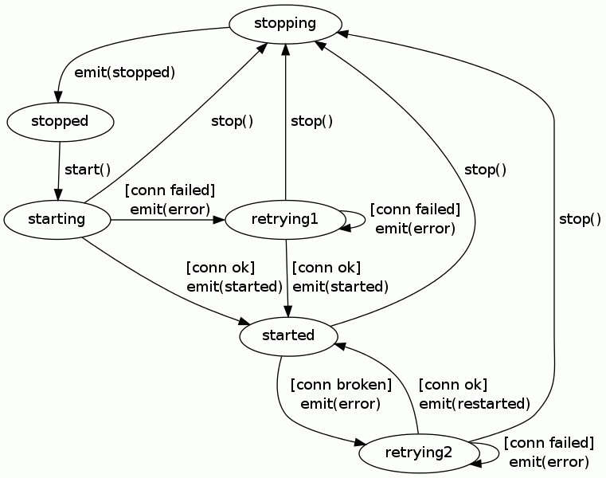

## Client state machine

Each instance of a client (as returned from `mqlight.createClient(...)` is
backed by the following state machine:

Each of the states shown in the state machine diagram corresponds to the values
stored i the `mqlight.Client.state` property, with the exception of `retrying1`
and `retrying2` which are collapsed into a single `retrying` value. While in the
`retrying` state the client will wait for up approximately 60 seconds (based on
an exponential backoff algorithm) before attempting to transition into a new
state.

Each line shown in the state machine diagram represents a possible way in which
the client can transition between states. The lines are labelled with
information about the transitions, which includes:
1. The function calls that can cause the transition to occur:
  * `start()` corresponds to the `mqlight.Client.start` function.
  * `stop()` corresponds to the `mqlight.Client.stop` function.
2. Change that occur at the network level, which can cause the transition to
   occur. For example:
  * `[broken]` occurs when an established network connection between the client
    and the server is interrupted.
  * `[connected]` occurs when the client successfully establishes a network
    connection to the server.
  * `[failed]` occurs when the client unsuccessfully attempts to establish a
    network connection to the server.
3. Events that are emitted. Specifically:
  * `<error>` indicates that an error event is emitted.
  * `<restarted>` indicates that a restarted event is emitted.
  * `<started>` indicates that a started event is emitted.
  * `<stopped>` indicates that a stopped event is emitted.
